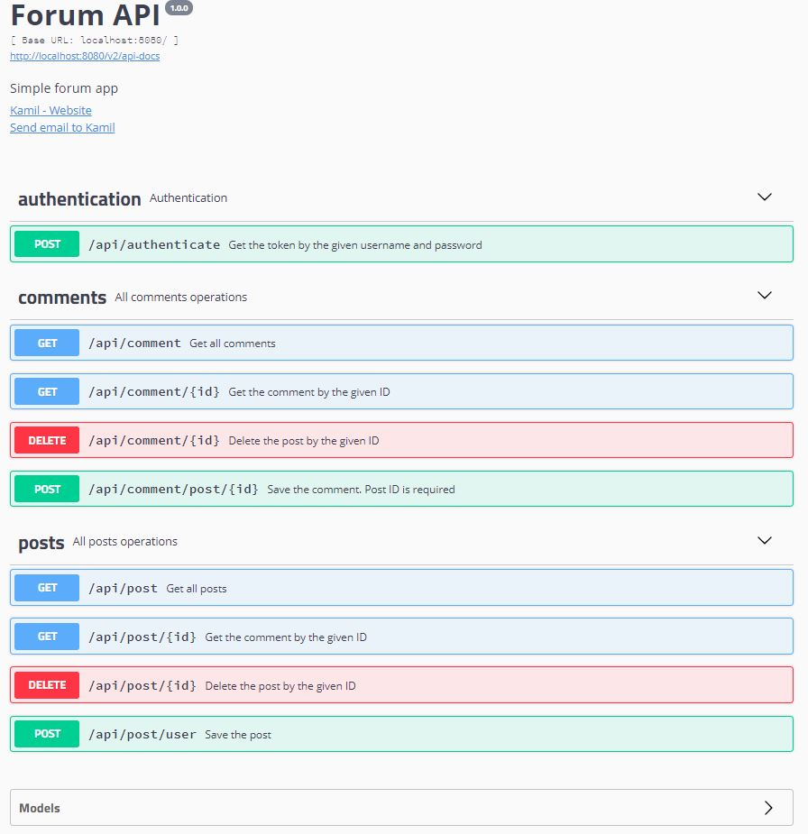

# forum-engine-rest
Simple Spring REST forum app.

## API documentation
`http://localhost:8080/swagger-ui.html`




## Technologies:
Project is created with:
```
* Spring Boot
* Spring REST
* Hibernate
* Spring Security
* Swagger 2
* JWT
```

## Requirements:
To run application you need:
```
* JDK 8
* Maven 3.6
```

## Run application
```
git clone https://github.com/kamil25k/forum-engine-rest.git
cd ../forum-engine-rest
mvn spring-boot:run
```
